<div align="center">

# 🤖 G-MAN

### Высокопроизводительный фреймворк на Go для автоматизации Steam и торговых ботов

[](https://pkg.go.dev/github.com/lemon4ksan/g-man)
[](https://goreportcard.com/report/github.com/lemon4ksan/g-man)
[](LICENSE)
[](https://github.com/lemon4ksan/g-man/stargazers)

> _"Правильный бот в неправильном месте может изменить весь рынок скинов."_

#### 🇺🇸 [English](README.md) • 🇷🇺 [Русский](README_RU.md)

</div>

**G-man** — это высокопроизводительный SDK клиентской части Steam и многофункциональный фреймворк для автоматизации игр на Go. Разработанный для высокочастотного трейдинга, крупномасштабного управления инвентарем и отказоустойчивых сетевых операций, G-man объединяет сеть Steam и игровые координаторы (Game Coordinators) в единый потокобезопасный оркестратор. Он бесшовно сочетает протоколы **Socket (CM)**, **WebAPI** и **игровые координаторы**, обеспечивая стабильную работу вашего бота в режиме 24/7.

## 🛠 Архитектурный обзор

Система спроектирована на основе слабосвязанной событийно-ориентированной архитектуры с использованием модели CSP в Go. Объект `Client` выступает центральным оркестратором, распределяя события между изолированными потокобезопасными модулями и автоматически балансируя нагрузку:

```mermaid
flowchart LR
    classDef steam fill:#1b2838,stroke:#66c0f4,stroke-width:2px,color:#fff;
    classDef transport fill:#2a475e,stroke:#66c0f4,stroke-width:1px,color:#c7d5e0;
    classDef core fill:#171a21,stroke:#cba6f7,stroke-width:2px,color:#cdd6f4;
    classDef module fill:#313244,stroke:#a6e3a1,stroke-width:1px,color:#cdd6f4;
    classDef pipeline fill:#45475a,stroke:#f9e2af,stroke-width:1px,color:#f9e2af,stroke-dasharray: 5 5;
    classDef action fill:#a6e3a1,stroke:#a6e3a1,stroke-width:2px,color:#11111b;

    subgraph External [Steam Сеть]
        Steam((Steam Cloud))
    end
    class External steam;

    subgraph Transport [Транспортный движок]
        direction TB
        Socket[CM-клиент Socket]
        WebAPI[REST / WebAPI]
    end
    class Transport,Socket,WebAPI transport;

    subgraph Core [G-MAN Оркестратор]
        Router{Сервисный роутер}
        Bus([Шина событий Bus])
    end
    class Core,Router,Bus core;

    subgraph Modules [Доменные модули]
        direction TB
        TF2[TF2 GC & Инвентарь]
        Social[Чат & Друзья]
        Ach[Достижения]
    end
    class Modules,TF2,Social,Ach module;

    subgraph TradeEngine [Торговый движок Onion]
        direction LR
        P1[Дедупликация] --> P2[Черные списки] --> P3[Валидация цен PriceDB] --> P4[Автоплавка и контр-предложения]
    end
    class TradeEngine,P1,P2,P3,P4 pipeline;

    Verdict{Вердикт}
    class Verdict action;

    Steam <--> Socket & WebAPI
    Socket & WebAPI <--> Router
    Router <--> Bus

    Bus <--> TF2 & Social & Ach

    TF2 -- "Новое предложение" --> P1
    P4 --> Verdict

    Verdict -- "Принять/Отклонить" --> Router
    Router -- "Выполнить" --> Steam
```



## ⚡ Ключевые возможности

### 🔄 Самовосстанавливающиеся сессии (Silent Re-auth)

Простой бота — это потерянная прибыль. G-man в фоновом режиме отслеживает состояние веб-сессий и токенов доступа. Если веб-куки истекают прямо во время выполнения запроса, оркестратор приостанавливает активные операции, атомарно обновляет OAuth2-сессию, сохраняет новые токены в хранилище и возобновляет запросы прозрачно для пользователя. Ваша бизнес-логика никогда не столкнется с ошибками `401 Unauthorized` или разрывом сессии.

### 🌐 Двухстековый транспортный движок

Больше не нужно выбирать между WebAPI и сокетами Connection Manager (CM). Протокольно-независимый слой маршрутизации G-man динамически выбирает оптимальный путь: **TCP/WebSocket CM-каналы** для синхронизации состояния в реальном времени с минимальной задержкой или **HTTPS WebAPI** для массовых транзакций и минимизации лимитов запросов. При разрыве сокета движок автоматически и плавно переходит на HTTP.

### 🧅 Конвейерная система сделок (Onion Trade Middleware)

Стройте сложную логику проверки сделок в виде независимых middleware-компонентов. Обрабатывайте входящие предложения через цепочку фильтров: `Deduplicator` $\rightarrow$ `SecurityEscrowCheck` $\rightarrow$ `BlacklistFilter` $\rightarrow$ `PriceDBValidator` $\rightarrow$ `AutoSmelter`. Если любой из middleware выносит окончательный вердикт (Принять/Отклонить/Контр-предложение), цепочка прерывается, исключая состояние гонки.

### 🌡️ Защитный веб-скрейпинг

Steam часто возвращает «мягкие ошибки» — HTML-страницы со статусом `200 OK`, содержащие текст с предупреждением (например, «Превышен лимит запросов», блок «Семейного просмотра» или форму авторизации). Защитный скрейпер модуля `community` сканирует тела ответов, переводит двусмысленный HTML в строго типизированные ошибки Go и инициирует обработчики безопасности.

### 🎒 Торговый инструментарий Team Fortress 2 (TF2)

G-man поставляется с готовым к промышленной эксплуатации модулем для автоматизации экономики TF2:

- **Стейтфул-система PriceDB и автооценщик:** Обновление цен в реальном времени через Socket.IO и локальное кеширование.
- **Конкурентный демпинг и защита от резких скачков (Price Swing Limits):** Анализ снапшотов backpack.tf для автоматического перебивания цен конкурентов с защитой от резкого падения или взлета стоимости, предотвращая манипуляции с рынком.
- **Умные встречные предложения и плавка металла:** Автоматический расчет разницы в стоимости сделки, плавка или объединение металлов (`Refined` $\leftrightarrow$ `Reclaimed` $\leftrightarrow$ `Scrap`) для точной сдачи, а также извлечение недостающих ключей или предметов из инвентаря партнера для создания встречного предложения.
- **Симулятор достижений:** Имитирует реалистичное разблокирование достижений и отправку статистики игрового координатора, маскируя бота под обычного игрока.

## 📂 Структура проекта

```text
pkg/
├── steam/            # Ядро протокола Steam и управление жизненным циклом
│   ├── auth/         # Авторизация OAuth2, персистентность и фоновое обновление токенов
│   ├── socket/       # Стейтфул-клиент TCP/WebSocket Connection Manager (CM)
│   ├── protocol/     # Форматы сообщений Steam, скомпилированные protobuf-файлы и спецификации
│   ├── transport/    # Двухстековый транспортный мост (маршрутизатор Socket/HTTP)
│   ├── social/       # Чат в реальном времени, статусы пользователей и списки друзей
│   ├── community/    # Защитные скрейперы (Инвентари, Маркет, Steam Guard)
│   └── sys/          # Внутренние подсистемы (диспетчер игрового координатора, директория)
├── tf2/              # Промышленные модули торговли и домена TF2
│   ├── schema/       # Динамический парсер схем, SKU-генератор и нормализатор атрибутов
│   ├── currency/     # Металлическая арифметика (Ключи, Очищенный, Восстановленный, Металлолом)
│   ├── backpack/     # Единый SOCache-Web менеджер и синхронизатор инвентаря
│   ├── pricedb/      # Подключаемые провайдеры цен с интеграцией Socket.IO
│   ├── bptf/         # Менеджер активных листингов и снапшотов backpack.tf
│   └── behavior/     # Высокоуровневые сценарии (автоплавка, лимиты запасов, балансировка)
├── behavior/         # Общее автоматизированное поведение ботов
│   └── achievements/ # Эмулятор достижений с человекоподобным поведением
├── trading/          # Унифицированный движок торговых предложений
│   └── engine/       # Конвейер обработки (Onion) с контекстом TradeContext
├── bus/              # Потокобезопасная шина событий для слабой связи модулей
└── rest/             # REST-клиент с санитаризацией и типизацией ответов
```

## 🚀 Быстрый старт

### 1. Инициализация и запуск клиента

Подключитесь к сети Steam, пройдите авторизацию и запустите автоматический обработчик сделок всего несколькими строками кода:

```go
package main

import (
	"context"
	"os"

	"github.com/lemon4ksan/g-man/pkg/log"
	"github.com/lemon4ksan/g-man/pkg/steam"
	"github.com/lemon4ksan/g-man/pkg/steam/auth"
	"github.com/lemon4ksan/g-man/pkg/steam/sys/directory"
	"github.com/lemon4ksan/g-man/pkg/storage/jsonfile"
	"github.com/lemon4ksan/g-man/pkg/tf2"
	"github.com/lemon4ksan/g-man/pkg/trading/engine"
	webtrading "github.com/lemon4ksan/g-man/pkg/trading/web"
)

func main() {
	// 1. Настраиваем хранилище сессий в JSON-файле для сохранения токенов авторизации
	store, _ := jsonfile.New("storage.json")
	logger := log.New(log.DefaultConfig(log.LevelInfo))

	// 2. Инициализируем оркестратор с модулями TF2 и торговли
	client, _ := steam.NewClient(steam.Config{Storage: store},
		steam.WithLogger(logger),
		tf2.WithModule(), 
		webtrading.WithModule(webtrading.Config{}),
	)
	defer client.Close()

	// 3. Подключаем движок middleware к менеджеру сделок через автоматический процессор
	tradeEngine := engine.New()
	// Добавьте ваши middleware здесь...
	
	webTradeManager := client.Module("trading").(*webtrading.Manager)
	webTradeManager.SetOfferHandler(context.Background(), engine.NewBotHandler(tradeEngine, logger), nil)

	// 4. Запрашиваем оптимальный сервер и выполняем вход
	dir := directory.New(client.Service())
	server, _ := dir.GetOptimalCMServer(context.Background())
	login := auth.NewLogOnDetails(os.Getenv("STEAM_USER"), os.Getenv("STEAM_PASS"))

	if err := client.Run(); err != nil {
		panic(err)
	}

	if err := client.ConnectAndLogin(context.Background(), server, login); err != nil {
		panic(err)
	}

	client.Wait()
}
```

### 2. Конфигурация промежуточного ПО сделок (Onion Trade Middlewares)

Вы можете строить гибкие сценарии фильтрации предложений с помощью создания модульных middleware-компонентов. Пример middleware-прослойки, валидирующей стоимость предметов:

```go
package main

import (
	"github.com/lemon4ksan/g-man/pkg/trading"
	"github.com/lemon4ksan/g-man/pkg/trading/engine"
	"github.com/lemon4ksan/g-man/pkg/trading/reason"
)

// PriceValidationMiddleware выполняет строгую валидацию цен
func PriceValidationMiddleware(priceProvider PriceProvider) engine.Middleware {
	return func(next engine.Handler) engine.Handler {
		return func(ctx *engine.TradeContext) error {
			for _, item := range ctx.Offer.ItemsToGive {
				price, err := priceProvider.GetPrice(item.SKU)
				if err != nil {
					ctx.Review(reason.ReviewEngineError)
					return err
				}

				if item.Value < price.SellMinVal {
					// Партнер предложил слишком мало: мгновенно отклоняем сделку
					ctx.Decline(reason.DeclineUnderpaid)
					return nil // Прерываем цепочку
				}
			}

			return next(ctx)
		}
	}
}
```

## 🏗 План развития (Roadmap)

### Ядро инфраструктуры

- [x] **Умная маршрутизация транспорта:** Потокобезопасная отправка через Socket или HTTP.
- [x] **WebSession Keep-Alive:** Фоновое поддержание веб-куков и API-ключей в актуальном состоянии.
- [x] **Невидимое переподключение (Silent Re-auth):** Фоновое обновление сессий без прерывания запросов.
- [x] **Глобальные прокси-серверы:** Интеграция SOCKS5/HTTP-туннелей во все компоненты сети.
- [ ] **Steam CDN Downloader:** Модуль парсинга манифестов приложений и загрузки игровых ресурсов.

### Модуль TF2 и Игровой координатор

- [x] **Объединенный кэш инвентаря:** Синхронизация данных SOCache координатора и веб-инвентаря.
- [x] **Динамический SKU-нормализатор:** Парсинг качеств, эффектов и свойств предметов.
- [x] **Автоматическая плавка:** Многоэтапная плавка металлов и крафтинг оружия.
- [x] **Синхронизация с Backpack.tf:** Создание, обновление листингов и парсинг снапшотов.
- [ ] **Координатор CS2:** GC-рукопожатия, парсинг скинов оружия и сбор статистики матчей.
- [ ] **Координатор Dota 2:** Парсинг предметов SOCache и управление лобби.

## 🤝 Участие в разработке

Мы приветствуем вклад сообщества в развитие G-man! Если вы хотите добавить поддержку новых хранилищ, реализовать структуры GC для CS2/Dota 2 или улучшить алгоритмы защитного скрейпинга:

1. Ознакомьтесь с философией архитектуры в [CONTRIBUTING.md](CONTRIBUTING.md).
2. Убедитесь, что сетевые запросы проходят через абстракцию `transport.Doer`.
3. Напишите соответствующие юнит-тесты и проверьте потокобезопасность с помощью `go test -race ./...`.

## ☕ Поддержать проект

Создание полноценного SDK для Steam промышленного масштаба требует сотен часов обратной разработки протоколов Valve. Если G-man помог вам автоматизировать ваши торговые процессы или снизить потребление серверных ресурсов, поддержите его развитие:

<div align="center">

[](https://steamcommunity.com/tradeoffer/new/?partner=1141078357&token=HjsTJQFX)

> _"Пожертвования... не являются обязательными, но... они соответствуют условиям нашего... соглашения."_

</div>

## ⚖️ Лицензия и Юридическая информация

**Дисклеймер:** Данное программное обеспечение **не** связано с корпорацией **Valve Corporation**, не поддерживается и не одобряется ею или её дочерними компаниями. Steam, Team Fortress 2 и все сопутствующие активы являются товарными знаками Valve Corporation. Вы используете эту библиотеку исключительно на свой страх и риск.

Проект распространяется под лицензией **BSD 3-Clause License**. Подробнее см. в файле [LICENSE](LICENSE).

---

<div align="center">
  <sub>Будьте готовы к непредвиденным последствиям... или просто к следующей распродаже в Steam.</sub>
</div>
