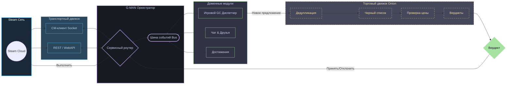

<div align="center">

# 🤖 G-MAN

### Фреймворк на Go для автоматизации Steam и торговых систем

[](https://pkg.go.dev/github.com/lemon4ksan/g-man)
[](https://goreportcard.com/report/github.com/lemon4ksan/g-man)
[](LICENSE)
[](https://github.com/lemon4ksan/g-man/stargazers)

> _"Правильный бот в неправильном месте может изменить весь рынок скинов."_

#### 🇺🇸 [English](README.md) • 🇷🇺 [Русский](README_RU.md)

</div>

**G-man** — это высокопроизводительный, промышленный SDK клиентской части Steam и фреймворк для автоматизации игровых операций на Go. Разработанный для высокочастотного трейдинга, масштабного управления инвентарем и отказоустойчивой сетевой работы, G-man объединяет сеть Steam и игровые координаторы (Game Coordinators) в единый потокобезопасный оркестратор. Он бесшовно сочетает протоколы **Socket (CM)**, **WebAPI** и **игровые координаторы**, обеспечивая непрерывную работу ваших автоматизированных цепочек в режиме 24/7.

```shell
go get github.com/lemon4ksan/g-man@latest
```

## 🛠 Архитектурный обзор

Система спроектирована на основе слабосвязанной событийно-ориентированной архитектуры с использованием модели CSP в Go. Объект `Client` выступает центральным оркестратором, распределяя события между изолированными потокобезопасными модулями и автоматически балансируя нагрузку:



## ⚡ Ключевые возможности

* **Самовосстанавливающиеся сессии (Silent Re-auth):** Отслеживает состояние веб-сессий и токенов доступа в фоновом режиме. Если веб-куки истекают, оркестратор приостанавливает активные запросы, выполняет обновление OAuth2, обновляет хранилище и прозрачно возобновляет операции.
* **Двухстековый транспортный движок:** Динамически выбирает оптимальный путь: каналы TCP/WebSocket CM для синхронизации состояния в реальном времени или HTTPS WebAPI для массовых транзакций. Движок автоматически переходит на HTTP при разрыве сокета.
* **Конвейерная система сделок (Onion Trade Middleware):** Позволяет строить независимую логику проверки сделок. Обрабатывайте входящие предложения через цепочку фильтров: `Deduplicator` $\rightarrow$ `SecurityEscrowCheck` $\rightarrow$ `BlacklistFilter` $\rightarrow$ `PriceValidator` $\rightarrow$ `Verdict`.
* **Защитный веб-скрейпинг:** Анализирует HTML-страницы, возвращающие статус `200 OK`, на наличие скрытых «мягких ошибок» (например, сообщений о превышении лимитов, блокировках семейного просмотра или формах входа) и преобразует их в строго типизированные ошибки Go.
* **Надежное управление зависимостями:** Использует алгоритм поиска в глубину (DFS) для топологической сортировки и инициализации модулей при запуске, предотвращая циклические блокировки.

## 🚀 Быстрый старт

### 1. Инициализация и запуск клиента

```go
package main

import (
	"context"
	"os"

	"github.com/lemon4ksan/g-man/pkg/log"
	"github.com/lemon4ksan/g-man/pkg/steam"
	"github.com/lemon4ksan/g-man/pkg/steam/auth"
	"github.com/lemon4ksan/g-man/pkg/steam/sys/directory"
	"github.com/lemon4ksan/g-man/pkg/storage/jsonfile"
	webtrading "github.com/lemon4ksan/g-man/pkg/trading/web"
)

func main() {
	// 1. Инициализируем хранилище сессий в JSON-файле
	store, _ := jsonfile.New("storage.json")
	logger := log.New(log.DefaultConfig(log.LevelInfo))

	config := steam.DefaultConfig()
	config.Store = store

	// 2. Инициализируем оркестратор с необходимыми модулями
	client, _ := steam.NewClient(config,
		steam.WithLogger(logger),
		webtrading.WithModule(webtrading.DefaultConfig()),
	)
	defer client.Close()

	if err := client.Run(); err != nil {
		panic(err)
	}

	// 3. Запрашиваем оптимальный сервер CM и выполняем вход
	dir := directory.New(client.Service())
	server, _ := dir.GetOptimalCMServer(context.Background())
	login := auth.NewLogOnDetails(os.Getenv("STEAM_USER"), os.Getenv("STEAM_PASS"))

	if err := client.ConnectAndLogin(context.Background(), server, login); err != nil {
		panic(err)
	}

	client.Wait()
}
```

### 2. Конфигурация промежуточного ПО сделок (Onion Trade Middlewares)

```go
package main

import (
	"github.com/lemon4ksan/g-man/pkg/trading/engine"
	"github.com/lemon4ksan/g-man/pkg/trading/reason"
)

func PriceValidationMiddleware(priceLimit int) engine.Middleware {
	return func(next engine.Handler) engine.Handler {
		return func(ctx *engine.TradeContext) error {
			totalGiveValue := 0
			for _, item := range ctx.Offer.ItemsToGive {
				if price, ok := ctx.Get("price_" + item.SKU); ok {
					totalGiveValue += price.(int)
				}
			}

			if totalGiveValue > priceLimit {
				ctx.Review(reason.ReviewEngineError)
				return nil // Безопасно прерываем цепочку
			}

			return next(ctx)
		}
	}
}
```

## 🎮 Расширения для поддержки игр

Игровая логика вынесена из основного фреймворка в отдельные репозитории:

* **[g-man-tf2](https://github.com/lemon4ksan/g-man-tf2)**: Автоматизация торговли и экономики Team Fortress 2
  - **Металлическая арифметика:** Расчеты с ключами, очищенными, восстановленными металлами и ломом.
  - **Автоплавка:** Динамическое объединение оружия и плавка металлов для формирования точной сдачи.
  - **Синхронизация с Backpack.tf:** Управление активными листингами и демпинг цен конкурентов.

## 🚀 Производительность и эффективность памяти

* **Небольшой объем кучи:** Базовой архитектуре бота требуется приблизительно **~4.5 МБ** активной памяти кучи в режиме ожидания (включая шину событий, отслеживание друзей и менеджеры торговли).
* **Пулы буферов:** Сериализация сетевых пакетов использует пулы буферов для снижения нагрузки на GC при высокой интенсивности запросов.

## 🏗 Дорожная карта

- [x] **Маршрутизация транспорта:** Потокобезопасная отправка запросов через сокеты или HTTP.
- [x] **Сессии WebSession:** Фоновый keep-alive для веб-кук и API-ключей.
- [x] **Тихая повторная авторизация:** Фоновое восстановление просроченных JWT.
- [x] **Топологическая сортировка:** Детерминированный запуск модулей без циклов.
- [ ] **Загрузчик Steam CDN:** Динамическое скачивание манифестов и игровых ассетов.
- [ ] **Координатор CS2:** GC-рукопожатие, парсинг скинов и лобби-менеджер.
- [ ] **Координатор Dota 2:** Поддержка пакетов SOCache и управление лобби.

## 🤝 Участие в разработке

Мы рады новым участникам! Если вы хотите расширить поддержку баз данных, добавить новые структуры GC для Dota 2 / CS2 или оптимизировать скрейпинг:

1. Ознакомьтесь с философией проектирования в [CONTRIBUTING.md](CONTRIBUTING.md).
2. Минимизируйте сетевые зависимости, пропуская трафик через интерфейс `transport.Doer` для удобства тестирования.
3. Проверяйте изменения на потокобезопасность с помощью `go test -race ./...`.

## ☕ Поддержка проекта

Создание масштабируемых и отказоустойчивых ботов для Steam требует сотен часов обратной разработки протоколов. Если G-MAN помог сэкономить ресурсы ваших серверов или автоматизировать ваши торговые операции, вы можете поддержать проект:

<div align="center">

[](https://steamcommunity.com/tradeoffer/new/?partner=1141078357&token=HjsTJQFX)

> _"Пожертвования... не обязательны, но... соответствуют условиям нашего... соглашения."_

</div>

## ⚖️ Лицензия и правовая информация

**Дисклеймер:** Это программное обеспечение **не** связано с корпорацией **Valve**, не поддерживается и не одобряется ей. Steam, Team Fortress 2 и все сопутствующие товарные знаки являются собственностью Valve Corporation. Вы используете данный фреймворк на свой страх и риск.

Проект распространяется под лицензией **BSD 3-Clause License**. Подробности в файле [LICENSE](LICENSE).
