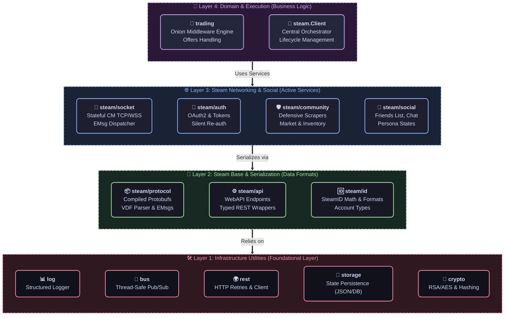

# 📦 G-MAN SDK Packages

### Modular, Interface-Driven Components for Steam & Game Coordinator Automation

#### 🇺🇸 [English](README.md) • 🇷🇺 [Русский](README_RU.md)

This directory contains the public API surface of the **G-man** framework. These packages form a highly decoupled, modular ecosystem. You can import the entire suite to build a full-featured Steam bot, or cherry-pick individual packages (e.g., `steam/community` for inventory scraping, `trading/engine` for Onion middleware, or `crypto` for mobile TOTP generation) to integrate directly into your existing Go applications.

## 🏗 Package Dependency Hierarchy

To maintain high performance and prevent circular imports (a common Go pitfall), G-man enforces a strict **layered import hierarchy**. Lower layers must never import higher layers:

## 📦 Package Overview

### 1. ⚙️ Core Layer (`pkg/steam`)
The foundation of the framework. It handles network communication, protocol serialization, and API orchestration.

| Package | Description |
| :--- | :--- |
| **[steam](steam/)** | The main **Orchestrator**. Connects Socket, Auth, and Modules into a thread-safe, topologically booted `Client`. |
| **[steam/api](steam/api/)** | Target specifications, Steam error types (`EResult`), and response unmarshalers (VDF, JSON, Proto). |
| **[steam/auth](steam/auth/)** | Modern OAuth2 flows. Supports JWT, Refresh Tokens, and background re-auth cycles. |
| **[steam/community](steam/community/)** | Defensive Web Client for scraping `steamcommunity.com` inventories, market, and OpenID. |
| **[steam/guard](steam/guard/)** | Mobile Authenticator confirmations, 2FA codes, and mobile session state. |
| **[steam/id](steam/id/)** | Robust `SteamID` parser and formatter (SID2, SID3, and 64-bit formats). |
| **[steam/socket](steam/socket/)** | Stateful Connection Manager (CM) client. Handles heartbeats, routing, and job tracking. |
| **[steam/service](steam/service/)** | RPC commander translating Protobuf messages into unified service calls. |
| **[steam/social](steam/social/)** | Social features: real-time persona states, friend lists, and chat. |
| **[steam/transport](steam/transport/)** | Dual-stack transport bridge unifying CM Socket and HTTP into a single execution layer. |
| **[steam/webapi](steam/webapi/)** | Auto-generated wrappers for Steam's Web APIs. |

### 2. 🔌 System & Game Coordinators (`pkg/steam/sys`)
Gateways to Steam's internal systems and individual game servers.

| Package | Description |
| :--- | :--- |
| **[sys/gc](steam/sys/gc/)** | Base Game Coordinator client. Handles handshakes and multiplexed message routing. |
| **[sys/directory](steam/sys/directory/)** | ISteamDirectory API client for dynamic retrieval of active Steam CM server IP lists. |
| **[sys/apps](steam/sys/apps/)** | In-game status manager and socket app notification handler. |

### 3. 🧠 Trading Logic (`pkg/trading`)
The high-level request-response engine for automated trading behaviors.

| Package | Description |
| :--- | :--- |
| **[trading/engine](trading/engine/)** | The **Onion Middleware Engine**. Chains trade validation steps using context propagation. |
| **[trading/processor](trading/processor/)** | Core transaction lifecycle manager (*Check $\rightarrow$ Decide $\rightarrow$ Act $\rightarrow$ Notify*). |
| **[trading/review](trading/review/)** | High-value transaction auditing, trade logging, and administrative reviews. |
| **[trading/live](trading/live/)** | Support for GC-based real-time "Live Trade" sessions. |
| **[trading/web](trading/web/)** | Traditional Web-based Trade Offer operations via the Community API. |

### 🛠 4. Infrastructure & Storage
Utilities and core persistent storage providers used across the SDK.

| Package | Description |
| :--- | :--- |
| **[behavior](behavior/)** | Universal autonomous routines, including human-mimicking achievements and stats simulation. |
| **[bus](bus/)** | High-performance **Event Bus** for decoupled pub/sub modules. |
| **[crypto](crypto/)** | ECC, RSA cryptography, and TOTP algorithms for security operations. |
| **[jobs](jobs/)** | Thread-safe asynchronous job execution unit and async worker manager. |
| **[log](log/)** | Contextual, structured, module-aware logger. |
| **[rest](rest/)** | HTTP client wrapper featuring automatic retries, exponential backoffs, and parameters serialization. |
| **[storage](storage/)** | Interface-first storage provider with JSON and in-memory backends. |
| **[command](command/)** | CLI command routing, registration, and human command executor. |

## 🏗 Architecture & Philosophy

G-man packages are engineered with **Go best practices** in mind:

1. **Protocol Agnosticism**: Applications communicate with Steam via `steam.Client.Do()`. The internal routing engine automatically selects either the active CM Socket (for real-time speed) or HTTP WebAPI (as a fallback) depending on connectivity status.
2. **Interface-First Design**: Components communicate using tight consumer-defined interfaces. Rather than depending on concrete clients, structures depend on `Requester` or `Doer` contracts, keeping the system fully mockable.
3. **Concurrency Safety**: Circular states, heartbeats, and packet routing are managed using `sync/atomic` and read-write mutexes. All blocking operations explicitly accept a `context.Context`.
4. **Defensive Web Scraping**: The `community` client proactively converts hidden HTML errors (e.g., rate limits disguised as standard web views) into strictly typed Go errors like `ErrRateLimited`.
5. **Decoupled Extensions**: Domain-specific logic (e.g. game schemas, currency, item attributes) is pushed into external packages (like `g-man-tf2`), keeping the core framework lean and fast.
