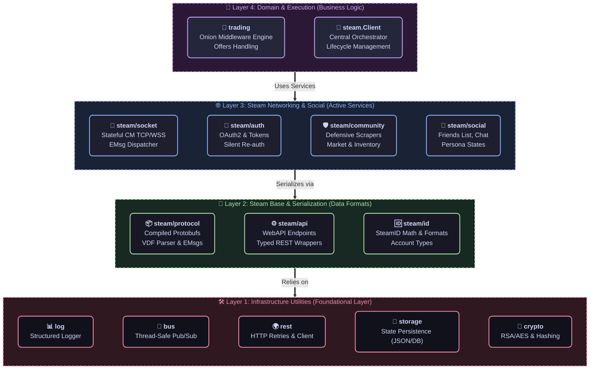

# 📦 G-MAN SDK Packages

### Modular, Interface-Driven Components for Steam & Game Coordinator Automation

#### 🇺🇸 [English](README.md) • 🇷🇺 [Русский](README_RU.md)

This directory houses G-man's modular Go packages. You can import the entire framework or select individual packages (e.g., `steam/community` for scraping, `trading/engine` for onion middleware, or `crypto` for mobile TOTP generation) to integrate into existing projects.

## 🏗 Package Dependency Hierarchy

To prevent circular imports and maintain separation of concerns, G-man enforces a unidirectional import hierarchy. Lower layers must never import packages in the layers above them:

## 📦 Package Catalog

### 1. Core Layer (`pkg/steam`)
The fundamental protocols and lifecycle systems of the client.

| Package | Description |
| :--- | :--- |
| **[steam](steam/)** | Main Orchestrator. Coordinates Socket, Auth, and registered modules within a thread-safe client lifecycle. |
| **[steam/api](steam/api/)** | Unified error definitions (`EResult`) and multi-format unmarshalers (VDF, JSON, Protobuf). |
| **[steam/auth](steam/auth/)** | OAuth2 state machine tracking JWT lifetimes and background cookie refreshes. |
| **[steam/community](steam/community/)** | Defensive HTTP client for handling inventory loads, market operations, and OpenID. |
| **[steam/guard](steam/guard/)** | Steam Guard operations, mobile confirmation retrievals, and TOTP generation. |
| **[steam/id](steam/id/)** | SteamID parser, formatter, and math utilities supporting SID2, SID3, and 64-bit formats. |
| **[steam/socket](steam/socket/)** | Connection Manager (CM) state machine handling TCP/WebSocket heartbeats and packet dispatch. |
| **[steam/service](steam/service/)** | RPC commander translating Protobuf definitions into unified service calls. |
| **[steam/social](steam/social/)** | Chat commands, friend-state sync, and persona state operations. |
| **[steam/transport](steam/transport/)** | Low-level execution layer uniting CM Sockets and HTTP under a single interface. |
| **[steam/webapi](steam/webapi/)** | Auto-generated standard Steam WebAPI endpoint wrappers. |

### 2. Game Coordinators & Subsystems (`pkg/steam/sys`)
Gateways to in-game coordination networks and app data.

| Package | Description |
| :--- | :--- |
| **[sys/gc](steam/sys/gc/)** | Base Game Coordinator client managing GC handshakes and packet demuxing. |
| **[sys/directory](steam/sys/directory/)** | DNS and API resolution of active Connection Manager (CM) server address pools. |
| **[sys/apps](steam/sys/apps/)** | Tracking of active app states and socket-level notifications. |

### 3. Trading Engine (`pkg/trading`)
Transaction lifecycles and business flow engines.

| Package | Description |
| :--- | :--- |
| **[trading/engine](trading/engine/)** | The **Onion Middleware Engine** facilitating step-by-step trade checks. |
| **[trading/processor](trading/processor/)** | Core transaction flow controller (*Evaluate $\rightarrow$ Decide $\rightarrow$ Act $\rightarrow$ Dispatch*). |
| **[trading/review](trading/review/)** | High-value trade validation, escrow holding checks, and administrator review logs. |
| **[trading/live](trading/live/)** | Support for GC-based real-time "Live Trading" session states. |
| **[trading/web](trading/web/)** | Legacy web-based Steam Trade Offers processing. |

### 4. Utilities & Support Services
Infrastructure packages utilized throughout the project.

| Package | Description |
| :--- | :--- |
| **[behavior](behavior/)** | Standardized, non-intrusive routines (e.g. human-mimicking achievements simulation). |
| **[bus](bus/)** | Core memory-safe event bus supporting parallel, decoupled subscription delivery. |
| **[crypto](crypto/)** | Encryption and decryption helpers (Symmetric/Asymmetric, Steam mobile signatures). |
| **[jobs](jobs/)** | Thread-safe asynchronous job scheduler and worker pool manager. |
| **[log](log/)** | Contextual, level-structured logging engine. |
| **[rest](rest/)** | Retrying HTTP client featuring exponential backoff. |
| **[storage](storage/)** | Persistent storage interfaces featuring standard JSON and memory adapters. |
| **[command](command/)** | Thread-safe command line registration and routing system. |

## 📐 Architecture Design Constraints

To maintain modularity and code quality, the library adheres to these core architectural constraints:

1. **Strict Mockability:** Structures depend on highly constrained interfaces (like `transport.Doer` or `storage.Store`) rather than concrete implementations, allowing developers to isolate and mock layers during testing.
2. **Channel-Based Concurrency:** Core event dispatching routes through the `bus` package to prevent locking bottlenecks. Shared state across routines relies heavily on `sync/atomic` and read-write locks (`sync.RWMutex`).
3. **Decoupled Extensions:** To prevent bloat, specialized game economies (like item schema processing or weapon smelting) are pushed to external packages like `g-man-tf2`, keeping the core framework code lean.
