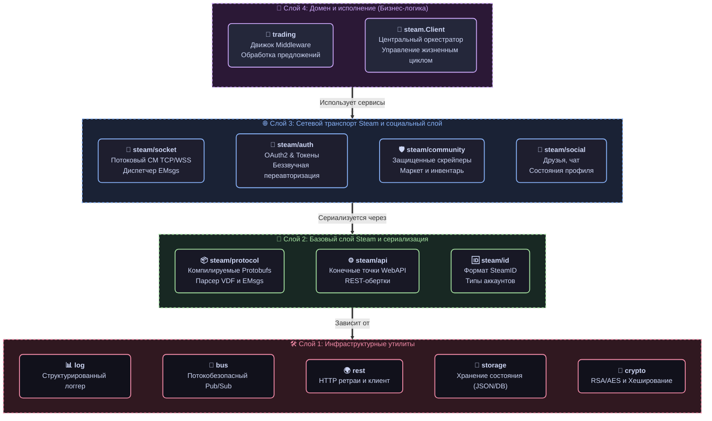

# 📦 G-MAN SDK Пакеты

### Модульные, интерфейсно-ориентированные компоненты для автоматизации Steam и игровых координаторов

#### 🇺🇸 [English](README.md) • 🇷🇺 [Русский](README_RU.md)

Этот каталог содержит общедоступный API фреймворка **G-man**. Представленные пакеты образуют слабосвязанную модульную экосистему. Вы можете импортировать всю библиотеку для создания полнофункционального Steam-бота или точечно выбирать отдельные пакеты (например, `steam/community` для скрейпинга инвентарей, `trading/engine` для проверки сделок или `crypto` для генерации мобильных кодов 2FA) для интеграции в ваши существующие Go-приложения.

## 🏗 Иерархия зависимостей пакетов

Чтобы поддерживать максимальную производительность и избегать циклического импорта (частая ловушка в Go), G-man строго следует **многоуровневой иерархии импортов**. Нижние слои никогда не должны импортировать пакеты из верхних:

## 📦 Обзор пакетов

### 1. ⚙️ Базовый слой (`pkg/steam`)
Фундамент фреймворка. Он берет на себя низкоуровневую рутину: сетевое взаимодействие, сериализацию протоколов и оркестрацию API.

| Пакет | Описание |
| :--- | :--- |
| 🔌 **[steam](steam/)** | Главный **Оркестратор**. Связывает сокеты, авторизацию и доменные модули в единый потокобезопасный, топологически запускаемый `Client`. |
| 🌐 **[steam/api](steam/api/)** | Описание конечных точек, типы ошибок Steam (`EResult`) и распаковщики ответов (VDF, JSON, Proto). |
| 🔑 **[steam/auth](steam/auth/)** | Современные сценарии авторизации OAuth2. Поддержка JWT, Refresh-токенов и фонового обновления сессии. |
| 🕵️‍♂️ **[steam/community](steam/community/)** | Защищенный веб-клиент для скрейпинга инвентарей `steamcommunity.com`, торговой площадки и авторизации OpenID. |
| 🛡️ **[steam/guard](steam/guard/)** | Подтверждение операций в мобильном аутентификаторе Steam Guard, генерация кодов 2FA и управление сессией. |
| 🆔 **[steam/id](steam/id/)** | Парсер и форматирование идентификаторов `SteamID` (поддержка SID2, SID3 и 64-битных значений). |
| 🔄 **[steam/socket](steam/socket/)** | Стейтфул-клиент для Connection Manager (CM) сокетов. Управление пингами, маршрутизацией и асинхронными задачами. |
| 📡 **[steam/service](steam/service/)** | Коммандер RPC, транслирующий Protobuf-сообщения в унифицированные сервисные вызовы. |
| 💬 **[steam/social](steam/social/)** | Социальные функции: статусы пользователей в реальном времени, списки друзей и чат. |
| 🌉 **[steam/transport](steam/transport/)** | Двухстековый транспортный мост, объединяющий CM-сокеты и HTTP в единую абстракцию. |
| 🛠 **[steam/webapi](steam/webapi/)** | Автоматически сгенерированные обертки для официальных Web API Steam. |

### 2. 🔌 Системные и игровые координаторы (`pkg/steam/sys`)
Шлюзы к внутренним механизмам Steam и выделенным серверам конкретных игр.

| Пакет | Описание |
| :--- | :--- |
| 🕹 **[sys/gc](steam/sys/gc/)** | Базовый клиент игрового координатора (Game Coordinator). Управление рукопожатиями и мультиплексированием пакетов. |
| 🗺 **[sys/directory](steam/sys/directory/)** | Клиент API ISteamDirectory для динамического получения списков активных IP-адресов CM-серверов. |
| 📦 **[sys/apps](steam/sys/apps/)** | Управление статусом нахождения в игре и обработка сокет-уведомлений приложений. |

### 3. 🧠 Торговая логика (`pkg/trading`)
Высокоуровневый движок обработки запросов торговых предложений.

| Пакет | Описание |
| :--- | :--- |
| 🧅 **[trading/engine](trading/engine/)** | Движок **Onion Middleware**. Строит конвейер проверок сделки с передачей контекста. |
| ⚙️ **[trading/processor](trading/processor/)** | Менеджер жизненного цикла транзакции (*Проверка $\rightarrow$ Решение $\rightarrow$ Действие $\rightarrow$ Уведомление*). |
| 📋 **[trading/review](trading/review/)** | Аудит ценных транзакций, логирование сделок и административный разбор. |
| 🤝 **[trading/live](trading/live/)** | Поддержка игровых сессий обмена в реальном времени ("Live Trade") через GC. |
| 🌐 **[trading/web](trading/web/)** | Классические веб-операции обмена предложениями через API сообщества. |

### 🛠 4. Инфраструктура и хранилища
Служебные утилиты и провайдеры постоянного хранения, используемые в рамках всего SDK.

| Пакет | Описание |
| :--- | :--- |
| 🎭 **[behavior](behavior/)** | Сценарии автоматического поведения ботов (включая человекоподобное открытие достижений). |
| 🚌 **[bus](bus/)** | Высокопроизводительная **Шина событий** для слабой связи модулей по схеме Pub/Sub. |
| 🔐 **[crypto](crypto/)** | Эллиптическая криптография, алгоритмы RSA и TOTP для мобильной авторизации. |
| ⏳ **[jobs](jobs/)** | Диспетчер асинхронных потокобезопасных задач для сопоставления запросов сокетов с ответами. |
| 📝 **[log](log/)** | Контекстный, структурированный логгер, поддерживающий тегирование модулей. |
| 🚀 **[rest](rest/)** | Обертка HTTP-клиента с автоматическими повторами, экспоненциальной задержкой и сериализацией. |
| 💾 **[storage](storage/)** | Провайдер постоянного хранения данных с адаптерами JSON и памяти. |
| 🔌 **[command](command/)** | Регистрация, маршрутизация и исполнение CLI-команд пользователя. |

## 🏗 Архитектура и принципы проектирования

Пакеты G-man спроектированы в соответствии с **лучшими практиками языка Go**:

1. **Протокольная независимость**: Приложения работают со Steam через `steam.Client.Do()`. Внутренний роутер автоматически перенаправляет трафик через активный сокет CM (для скорости) или HTTP WebAPI (для надежности) в зависимости от сети.
2. **Интерфейсы на стороне потребителя**: Компоненты слабо связаны и взаимодействуют через точечные интерфейсы. Структуры зависят от контрактов `Requester` или `Doer`, что делает систему на 100% тестируемой.
3. **Безопасная конкурентность**: Фоновые циклы, пинги и маршрутизация пакетов защищены с помощью `sync/atomic` и RWMutex. Все блокирующие вызовы в обязательном порядке принимают `context.Context`.
4. **Защитный веб-скрейпинг**: Клиент `community` превентивно конвертирует скрытые HTML-ошибки (например, превышение лимитов) в строго типизированные ошибки Go вроде `ErrRateLimited`.
5. **Декаплинг расширений**: Игровая логика (схемы предметов, арифметика валют, специфичные транзакции) выносится во внешние пакеты (например, `g-man-tf2`), оставляя ядро легким и быстрым.
